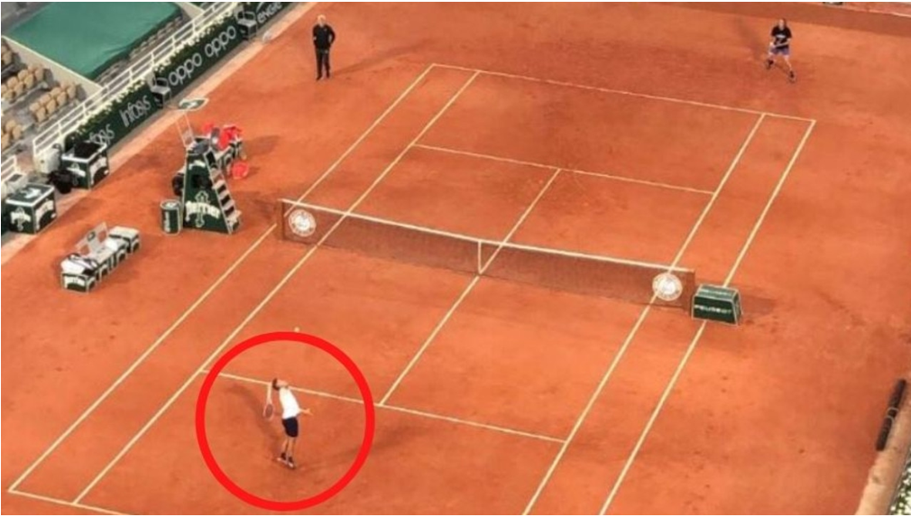
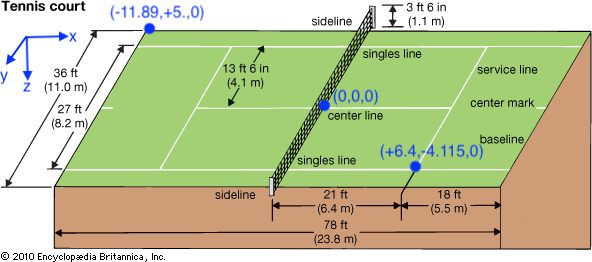
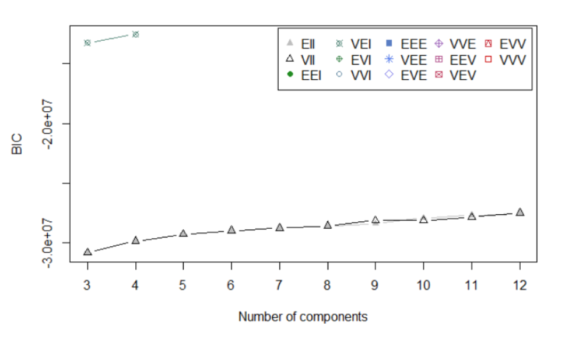
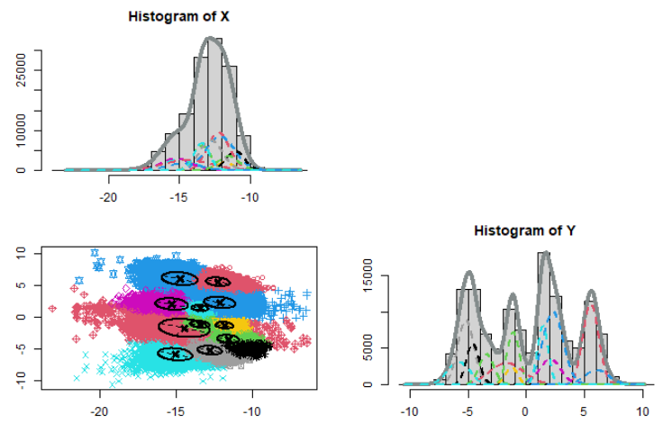
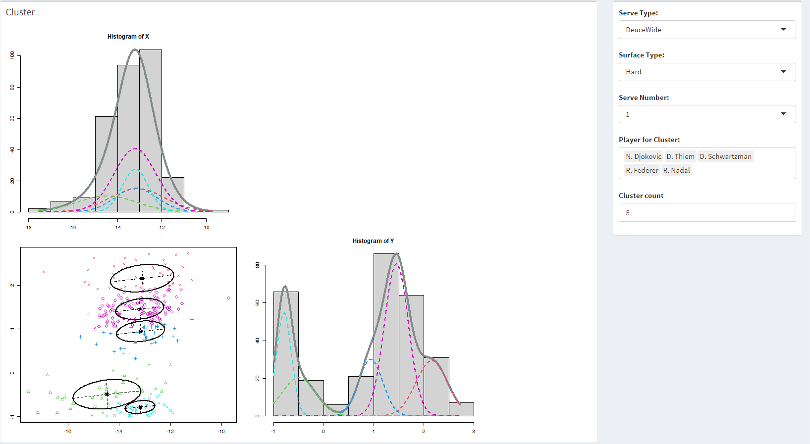
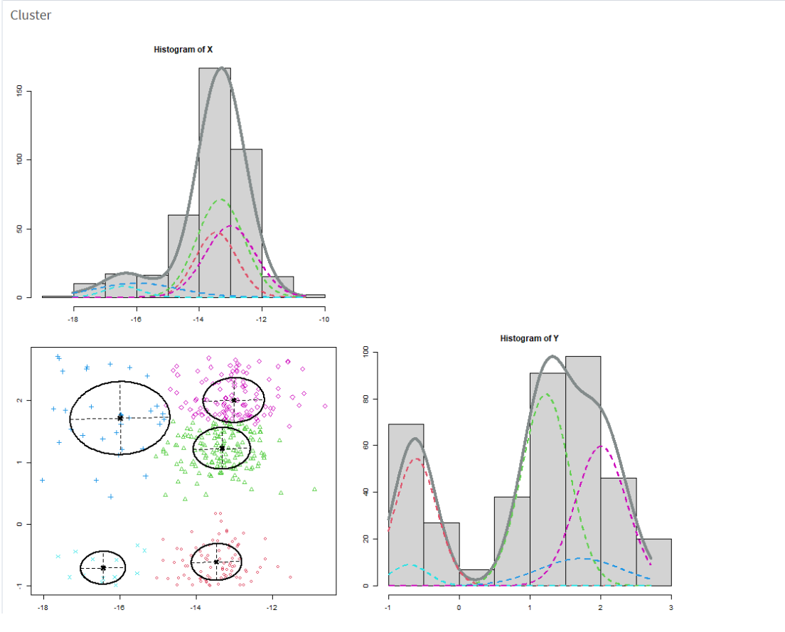
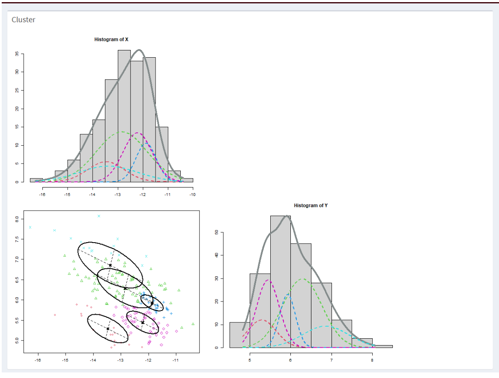

```{r xaringan-themer, include=FALSE, warning=FALSE}
knitr::opts_chunk$set(echo = FALSE, 
  message = FALSE,
  warning = FALSE,
  fig.width=10, 
  fig.height=7)
library(xaringanthemer)
library(readr)
library(tidyverse)
library(Rmixmod)
library(patchwork)
library(naniar)
library(xaringanExtra)
library(bomrang)
library(HeatStress)
library(colorspace)
library(kableExtra)
library(shiny)
library(shinydashboard)
```


```{r xaringan-slide-tone, echo=FALSE}
style_mono_accent(base_color = "#614bad")
xaringanExtra::use_panelset()
```


background-image: url(https://i2.wp.com/www.tennisnation.com/wp-content/uploads/2015/12/tennis-instruction.jpg)
background-size: cover
class: right, middle, inverse
# MAKING AN IMPACT
## Peimin Lin
#### Mentor: Stephanie Kovalchik 
#### Institute: Zelus Analytics


---
# Motivation

- Develop a model for return impact position

- The typical spatial characteristics of the return impact position of top men's players

- How are the serve number, serve direction, surface type influence their position?

- ATP lefties in the top 100 rankings' return impact

---
# What is the return impact?

.pull-left[ 

- **Serve Return** is the receiver hits off of their opponent's serve.

- **Return Impact** position is when the receiving player makes contact with the ball on the serve return

]


.pull-right[




]
---

class:middle

# Data Overview

.pull-left[ 
- **2018-2020**

- **1,287** matches 

- **84** players    

-  **25** variables 

- **126,455** observations 

]


.pull-right[

```{r}
position <- readRDS("data/position.rds") 
```

```{r data-structure, fig.cap="Mainly Variable Used"}
var <- data.frame(
  Variable = c("X","Y","Serve", "Player","Surface", "ServeType"),
  Description = c("Length of the Position(-23.77, 23.77)","Lateral of the Position(-11.89, 11.89)","Serve Number(First Serve, Second Serve)","Tennis Player Name(84 Players)", "Surface Type(Hard, Clay, Grass)", "Serve Direction(AdBody, AdWide, AdT,DeuceBody, DeuceWide, DeuceT)"))
var %>%
  kable(caption = "Mainly Variable Used") %>%
   kable_paper(full_width = F) %>%
  column_spec(1, bold = T, border_right = T) %>%
  column_spec(2, width = "30em", background = "white")
```

]

---

# Variable X and Y



???
- The data is summary tracking data total **1,287** matches and **84** players from **2018-2020** for the Men's Pro Tennis Tournament. 
- There are **25** variables and **126,455** observations in this data set and each observation refers to a single point within a match.


---

class: center, middle
# Exploration of the Data


---
# Model Discovery
### What is the Gaussian Mixture Model

$$f(x_i) = \sum_{k=1}^G\pi_kf_k(x_i; \mu_k, \Sigma_k)$$
where $f_k$ is usually a multivariate normal distribution. The parameters are estimated by maximum likelihood, and choice between models is made using BIC.

$$BIC = −2L(\hat{\theta}) + ν ln n$$ 


---
# BIC and Cluster
.pull-left[

### BIC Comparison



]

.pull-right[

### Cluster plot



]

???
Unsupervised classification
model
function in package
---
# Find the result

- The typical spatial characteristics of the return impact position of top men's players
- ATP lefties in the top 100 rankings' return impact
- How are the serve number, serve direction, surface type influence their position?


---

### The typical spatial characteristics of the return impact position of top 5 men's players

- N. Djokovic, R. Federer, D. Thiem, D. Schwartzman, R. Nadal

--


---
### ATP lefties in the top 100 rankings' return impact

.pull-left[

- right hand user



]

.pull-right[

- left hand user


]

---
### How are the serve number, serve direction, surface type influence their position?


---
class: center, middle

# Thanks!


---

class: center, middle
# Question Time


---

