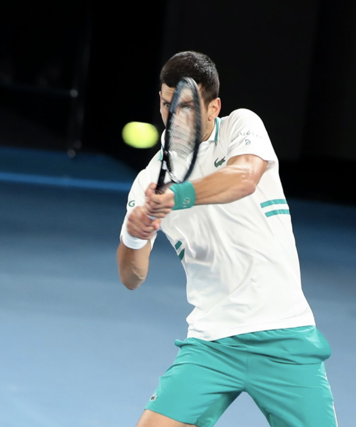
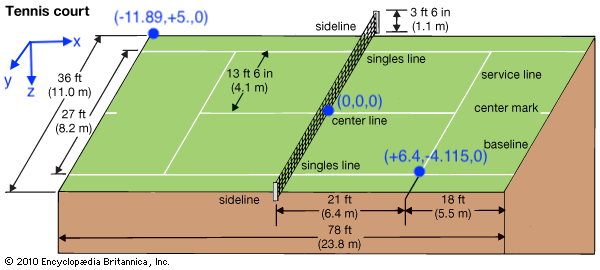

# RETURN IMPACT

The serve return is the most important defensive shot in tennis. Few statistical studies have examined return impact, largely because detailed data about player position at return impact has generally not been available. Using recently released tracking data summaries on the ATP Tour website of the 2D position of the ball at the time of return impact, this project will develop a generative model for the return impact position of professional male players.

### DEFINITIONS

The `serve return` is the shot the receiver hits off of their opponent's serve. The `return impact position` is the (x, y) position of the ball when the receiving player makes contact with the ball on the serve return. The (x, y) coordinate is length and lateral position with respect to the court coordinate system. These coordiantes are in meters where (0, 0) is the center of the net.

The image below describes the relevant dimensions of the tennis court in terms of the court coordinate system.

### DATA

The dataset includes return impact for returned points in ATP singles matches for events between 2018 and 2020. Thus, each row refers to a single point within  a match. The dataset is available under `data/position.rds`.

## PROJECT GOALS

A successful return impact model should provide a good description of return impact position (in 2D space) and variability in expected return position on any given point. The project should also identify key contextual variables that may influence return impact, including but not limited to:

- Serve number
- Serve direction
- Surface
- Receiver
- Server

Both the exploration, validation, and reporting of the model should use visualization tools and methods for spatial data. 
