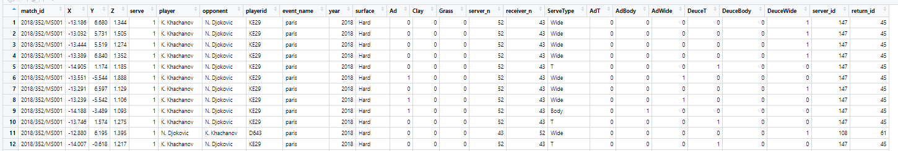

```{r setup, include=FALSE}
knitr::opts_chunk$set(echo = FALSE, cache=TRUE, messages=FALSE, warning=FALSE)
# Make sure you have the latest versions of rmarkdown and bookdown installed
library(ggplot2)
library(tidyverse)
library(ggExtra)
library(cluster)
library(NbClust)
library(Rmixmod)
library(mclust)
library(naniar)
```


\clearpage

# Introduction
What positions should players stand and get a better impact on the serve return? Are there any strategies that the players used during their tennis games? As we know, the serve return is also important in tennis, however, there is lots of analysis about the tennis before and return impact analysis were not really common, mainly because the positions of the data containing the 3D position is not easy to collect and there is not too much sample for analysis. In the project, we are going to explore a model for the return impact position of the profession mal players using recently go public tracking data summaries on the ATP Tour websites of the 2D position of the ball at the time of return impact,

# Overview the dataset
The data set Figure\@ref(fig:datset) includes return impact for returned points in ATP singles matches for events between 2018 and 2020. There are 25 variables and 126455 observations in this data set and each observation refers to a single point within a match. From Figure\@ref(fig:tidymiss), there is no missing value in the data set, so we omit the data wrragling this step and use the data directly. 

```{r datset, out.width="60%",fig.cap= "Data set overview"}

```


```{r read_data}
positions <- readRDS("data/position.rds")  
```


```{r overview}
summarydata <- summary(positions)

summarydata
```

```{r tidymiss, out.width="60%", fig.cap= "Check missing value"}
gg_miss_var(positions)
```


# Project Goals
This project will develop a generative model for the return impact position of professional male players. Furthermore, the project will identify key contextual variables that may influence return impact, including but not limited to:
* Serve number
* Serve direction
* Surface
* Receiver
* Server
Moreover, there is a shiny dashboard designed for the project visualisation.


# How variables influence player’s return impact


# Return Impact model

# Implementation

# User Guide

# Conclusion

# Bibliography


