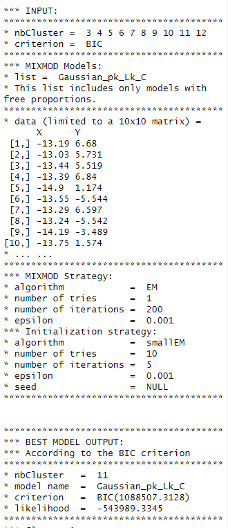

```{r setup, include=FALSE}
knitr::opts_chunk$set(echo = FALSE, cache=TRUE, messages=FALSE, warning=FALSE)
# Make sure you have the latest versions of rmarkdown and bookdown installed
library(ggplot2)
library(tidyverse)
library(ggExtra)
library(cluster)
library(NbClust)
library(Rmixmod)
library(mclust)
library(naniar)
library(factoextra)
library(kableExtra)
library(golem)
library(shiny)
```


```{r read_data}
position <- readRDS("data/position.rds")  

positions <- position %>% 
  mutate(hard = case_when(surface == "Hard" ~ "1",
                          surface == "Hard" ~ "0")) %>%
  pivot_longer(AdT:DeuceWide,
               names_to = "Servetype", 
               values_to = "values") %>%
  filter(values == 1) 
```


\clearpage


# Introduction
What positions should players stand and get a better impact on the serve return? Are there any strategies that the players used during their tennis games? As we know, the serve return is also important in tennis, however, there are lots of tennis analysis done by data scientists before except return impact analysis because the positions of the data containing the 3D position were not easy to collect and there were not too many samples for analysis. However, in the early 2000s return serve positions’ data began to be collected by some profession tracking systems like Hawkeye and since then, that data went public that more and more serve return analysis appeared[@step]. In the project, we are going to explore a model for the return impact position of the professional male players using recently go public tracking data summaries on the ATP Tour websites of the 2D position of the ball at the time of return impact containing 84 male players, 1287 tennis matches from 2018 to 2020. Find out the relationship between the return impact and serve number, serve type, tennis court types, left-hand and right-hand user player and servers through the RETURN IMPACT shiny dashboard. According to the result, it could provide some useful training strategy to coach during the training, players could forecast the positions should stand to defence during the match.
 
 
# Motivation
The motivation of this project is to develop a generative model for return impact positions of professional male players, discover the relationship between the return position and the typical spatial characteristics of the return impact position of men's player. Furthermore, a shiny dashboard was designed according to the data used in this project. Based on the dashboard, the project will check into the more detailed question. For example, does the serve number, serve direction, surface type make a separate influence for their return position? What about only two of those conditions? Or will all different conditions largely change their position? In the top 100 male tennis players, there are some left-handed players. Does their return position have a larger difference than the right-hand user player?
 

# Overview the dataset

The data provided by Zelus Analytics includes return impact for returned points in ATP singles matches total 84 male players, 1287 tennis matches between 2018 and 2020, There are 25 variables and 126455 observations in this data set and each observation refers to a single point within a match. The origin data can be found in [Github](https://github.com/skoval/monash-return-impact), however, there are only some variables used in this project. The Table\@ref(tab:datable) shows the main variables used in the project and their range. 

The position uses (X,Y,Z) to represent, which is the length, lateral and height of the position, the center of the net use (0,0,0). However, the project discovered the 2D position of the ball at the time of return impact which only used the length and lateral variable. Figure \@ref(fig:court) provided the visualisation of the tennis court, as players do not always hit the ball inside the tennis court that the X and Y range are over the length and lateral of the tennis court. 

```{r tidymiss, fig.cap= "Missing value check", fig.align="center"}
gg_miss_var(position)
```

In tennis rules, the first serve will not lose points if there is an error, however, it will lose points on the second serve if there is a mistake[@usta]. In general, there is no distinction between the first and second serves under the tennis rules. As the second serve will have a probability to lose points, players will have strategies to serve in the first and second serve. Thus, the project will have a further discussion about the serve number.

There are three types of tennis surface court now, one is hard court which is built of asphalt and concrete, one is grass which is the fastest of the tennis surface court among three and the last one is clay court, the slowest but makes the ball bounce higher. Different players have different strengths and strategies in different surface courts that this variable will also have further research.

For the serve type, there are separate by the center line that deuce court which is serve the ball on the right side of the court and Ad court is on the left side of the court. For more precise division of the position, there are T, Wide and body, T  is the serve position around the center of the court, Wide is around the edge of the court and body is in the middle of the Ad or Deuce serve position.
From Figure \@ref(fig:tidymiss), there is no missing value in the data set, so we omit the data wrangling this step and use the data directly.


```{r court, out.width="70%",fig.cap= "Tennis Court", fig.align="center"}
knitr::include_graphics("image/tennis_court.png")
```


```{r datable}
var <- data.frame(
  Variable = c("X","Y","Serve", "Player","Surface", "ServeType"),
  Description = c("Length of the Position(-23.77, 23.77)","Lateral of the Position(-11.89, 11.89)","Serve Number(First Serve, Second Serve)","Tennis Player Name(84 Players)", "Surface Type(Hard, Clay, Grass)", "Serve Direction(AdBody, AdWide, AdT,DeuceBody, DeuceWide, DeuceT)"))

var %>%
  kable(caption = "Mainly Variable Used") %>%
   kable_paper(full_width = F) %>%
  column_spec(1, bold = T, border_right = T) %>%
  column_spec(2, width = "30em", background = "white")
```


# What is the return impact
Before we start, there is a short introduction of tennis that will make you have a better understanding about the project. Serve in tennis is when a player uses a tennis racquet to hit the tennis ball and serve return if the receiver hits off of their opponent’s serve. Return impact position talking in this project is when the receiving player makes contact with the ball on the serve return. Figure \@ref(fig:returnimpact) shows the return impact position in a tennis match.


```{r returnimpact, out.width="70%",fig.cap= "Return Impact", fig.align="center"}
knitr::include_graphics("image/returnimpact.png")
```

# How variables influence player’s return impact

The first panel in shiny dashboard is a marginal distribution plot used to find out how the surface, serve type and serve number influence the player's return impact position. There are three selections on the top that can change the  surface, serve type in different players, for the serve number it was set as default and clarified in two colors that can better compare. 

## Surface 

```{r meantab}
surmean <- positions %>% 
  group_by(surface) %>% 
  summarize(X = mean(X),
            Y = mean(Y)) %>%
  kable(caption = "X and Y mean in difference types of surface") %>%
   kable_paper(full_width = F) %>%
  column_spec(1, bold = T, border_right = T) %>%
  column_spec(2, width = "10em", background = "white")
surmean
```

In order to make a better conclusion, table \@ref(tab:meantab) shows the average length and lateral return impact position in three types of the surface. In this part, the outstanding players in three surfaces will become the examples to analyze. 
The French Open is the only Grand Slam tournament played on a clay court, and Rafael, who has won 10 titles, is the king[@kilit]. Swat to Nadal, there is a regular range in clay court for his return impact position is (-14,-18) and the average X is -16.28605, Y is 0.7851137 which is a large difference to the average position. The serial Wimbledon winner, Roger Federer has a better performance in grass court according to his record. It can be found in the shinyapp that his return impact position in grass court is around 10 to 13. As the data did not have as many observations as hard and clay court, it will compare to the hard court for analyses. Federer's performance on hard courts can be found that the range is around 9 to 14. Grass courts have the highest speed but lower bounce because of the soft grass.

Combined with the characteristics of different surfaces and the average point can draw the conclusion that a player would stand in the farthest place in a clay court match to serve the ball because the clay court is considered to be the slowest surface among three and it has higher bounce. Players stand farther and would have more time to have the reaction and serve the ball. Players will stand near the center court in the hard courts because the hard courts have medium speed and the highest bounce due to the hardest surface. Grass courts have the highest speed but lower bounce because of the soft grass, players' return impact positions are to the middle compared to the hard court and the clay court.

## Serve Number

```{r sermean}
serv <- positions %>% 
  group_by(serve) %>%
  summarize(X = mean(X),
            Y = mean(Y)) %>%
  kable(caption = "X and Y mean in difference number of serve") %>%
   kable_paper(full_width = F) %>%
  column_spec(1, bold = T, border_right = T) %>%
  column_spec(2, width = "10em", background = "white")
serv
```


The shinyapp show the difference serve number in two colours and there is no need to select. Selected some top players for visualisation and can be found that second serve return impact positions were more forward to the center. The table \@ref(tab:sermean) confirmed this view, the second serve return impact position was moved forward to the center than the first serve. It is not hard to find why there is a difference between the first and second serve, because the first serve will not lose marks unless there is a fault in the second serve. Players usually will hit the ball with as much power, skill and deception as they can to win the point. If there is a fault in the first serve, players jump to the second serve that have a risk to lose points and they will have conservative strategies that hit less hard. According to these normal strategies, players will adjust their return serve position that first serve stand farther and have more flexibility, second serve stand near the center because the ball is less hard and variability. 

## Serve Type


```{r tracs}
courtTrace <- data.frame(x = c(-11.89, -11.89, -5.4, -5.4, -11.89, -11.89, -5.4, -5.4, -11.89, -6.4, -6.4, -5.4, -5.4, -5.4, -6.4),
                         y = c(5.49, -5.49, -5.49, 5.49, 5.49, 4.115, 4.115, -4.115, -4.115, -4.115, 4.115, 4.115, -4.115, 0, 0))

```

```{r sertype, fig.cap="The average position of different serve type"}
sertype <- positions %>% 
  group_by(Servetype) %>%
  summarize(X = mean(X),
            Y = mean(Y)) %>%
  ggplot(aes(y = Y, x = X)) + 
  annotate("rect", xmin=-Inf, xmax=-5.4, ymin=-Inf, ymax=Inf, fill="#0a8d45") +
  annotate("rect", xmin=-11.89, xmax=-5.4, ymin=-5.49, ymax=5.49, fill="lightgrey") +
  geom_path(data = courtTrace, aes(x = x, y = y), color = 'black', size = 1) +
  geom_segment(aes(x= -5.4, xend= -5.4, y= -6.5, yend= 6.5), size = 2, color = 'lightgrey', 
               lineend = 'round') +           
  geom_point(size = 3,  alpha = 0.5) +
  scale_colour_manual("Serve", values = c("orange", "#f572b9")) +
  theme_bw() +
  coord_flip() + 
  theme(legend.position = "top") +
  scale_x_continuous("Depth (meters from net)", n. = 8) +
  scale_y_continuous("Lateral position (meters from center)", n. = 8)
sertype
```

From Figure \@ref(fig:sertype) can find the deuce side position will be closer to the center of the court and the Ad side is farther. As there is not a big difference between the two sides, there is an assumption that the left hand user players and right hand user players will have a large difference in the two sides. There are some ATP left hand user in the top 100 ranking also in the data as well, for example, Radial Nadal, Albert Ramos Vinolas, Adrian Mannarino, Guido Pella and Feliciano Lopes those who only use left hand, Denis Shapovalov, Ugo Humbert and Cameron Norrie who are left hand user also two handed backhand player. The second panel of the shiny dashboard shinyapp can be used to analyze this question as well. Select two left hand user players or select one left hand user player and one right hand user player to compare. It can be found that the left hand user will serve closer to the court center in Ad serve compared to the deuce serve. 

Overview the influence to the return impact separately that player will have the farthest return impact position in clay surface and the hard court is the closest to the center. For the lose point reason, players have a closer position to the center to serve the second serve. Left hand user will serve the ball close to the center in Ad side while the right hand user player will serve the ball close to the center in the deuce side in general. 

# Model Selection

For those conclusions were all from the visualisation tool, the first and second panels of the Return Impact dashboard. What about the mixture influence of the variable to the return impact positions? 

Clustering is used to reducing the dimension of the observation space, cluster analysis also called unsupervised analysis, there most common methods is K-means clustering for using to group observations into a set of K groups, K-means attempts to classify observations into mutually exclusive groups or clusters, so that observations within the same cluster try to be similar. Suppose each cluster is the center of the cluster and after multiple unsupervised calculations to find out the best result of the center.

Another common clustering algorithm is Hierarchical clustering, which is used to confirm the cluster number of a data set. Difference from k means, it creates a hierarchy of clusters and no need to specify the number of clusters up front. In addition, its results can be easily visualized using a dendrogram to confirm the number of the components(bradley, 2020). Beside those two types, model-based clustering is used where observations have a probability of belonging to each cluster. Gaussian mixture model is a probabilistic model which suppose all data points are generated from a mixture of a finite number of Gaussian distributions whose parameters are unknown. The GMM object implements the Expectation Maximization algorithm to fit the Mixture Gaussian model and it can draw confidence ellipsoids for multivariate models and calculate Bayesian information criteria to evaluate the number of clusters in the data[@stickit].

Summarizing those visualisation characteristics, and finding out the relationship between the 2D outcome and the multiple variables, Gaussian Mixture Model would be the best choice in this project. 

## Gaussian Mixture Model

```{r gmm, out.width="100%",fig.cap= "GMM formula", fig.align="center"}

```
Figure \@ref(fig:gmm) where $f_k$ is usually a multivariate normal distribution. The parameters are estimated by maximum likelihood, and choice between models is made using BIC.

```{r bic, out.width="100%",fig.cap= "BIC formula", fig.align="center"}

```

Figure \@ref(fig:bic) where $log(n)$ is the maximized loglikelihood for the model and data, $m$ is the number of free parameters to be estimated in the given model, and $n$ is the number observations in the data.


## Cluster Selection


```{r bicplot, out.width="70%",fig.cap= "BIC plot", fig.align="center"}

```

```{r clusout, out.width="100%",fig.cap= "11 components", fig.align="center"}

```

```{r clustone, out.width="100%",fig.cap= "Cluster plot", fig.align="center"}

```

```{r clustnie, out.width="100%",fig.cap= "9 components", fig.align="center"}

```

```{r ninevar, out.width="100%",fig.cap= "variance and mean", fig.align="center"}

```

Although there are large models with many clusters, for better analysis, the project will set up the cluster number from 3 to 12 and calculate their BIC.
Figure \@ref(fig:bicplot) show the trend of the BIC. It can be found the larger number of the components, the smaller BIC it has.
Moving forward, the package `Rmixmod` provides a function to calculate the proportion, means variance of the cluster and find out the suitable number of components of the cluster. The function calculates 3 components to 12 components, and found the best number of the components is 11 figure \@ref(fig:clustout). However, as the plot shows the clusters have overlap figure \@ref(fig:clustone) and the BIC line showed a notable growth at 8 clusters that the project will suggest components of 9 or 10 for analysis. 
Figure \@ref(fig:clustnie) shows the result of number of 9 components and figure \@ref(fig:ninevar) shows the variance and the mean, it can found that the variance, proportion of the number of 9 cluster is similar and not too much variance compare to the number of components 11.
The last shiny panel is designed for clustering analysis, it can select multiple players in different surfaces, serve number, serve type under different number of components. Selecting the top 10 male players under ATP latest ranking, the cluster graph shows that they have the similar return impact positions under difference variable change which can provide suggestions to coach and players for the preparation of the tennis matches.

# Conclusion
The purpose of the project is to develop a generative model for return impact positions of professional male players and explore the relationship between the return position and the typical spatial characteristics of the return impact position of men's player. The project chose Gaussian Mixture Model to analyse the relationship between the 2D outcome return impact position and the tennis surface, serve number, serve type and players, select the number of components using Bayesian information criteria (BIC) and the cluster graph in a shiny dashboard. Meanwhile, for the relationship between the return impact position and the single external factor, the player stands farthest of the court to serve the ball in clay surface court and the closest in the hard court. Players have to stand farthest in the first serve because the first serve always has a harder, faster ball that serves to hit the first serve perfectly to get the points. There are some outstanding left-hand players in the top 100 ATP ranking, they have some characteristics when they have different serve types. Right-hand user players will serve the ball more forward in deuce serve while left-hand user players are familiar in Ad serve.

The model and the discovery can be used in a coach training plan and predict the player serve return position that reduces the probability to lose points to some extent. As the data set only from 2018 to 2020 and the players and matches are only the top players, for the improvement of the project is expand the dataset and better to have head-to-head data set that can explore the further question, for example, does player change they return impact position when they meet difference components? There are still lots of questions yet to be discovered. Hope there will be more and more return impact position analyse in the future.


# Acknowledgements

The dataset used in this project was provided from Zelus Analytics and written using R and `shiny`[@shin], the following packages were used to produce this project: `ggplot2`[@Springer], `naniar`[@naria], `tidyverse`[@tidyverse], `gridExtra`[@grid], `RColorBrewer`[@rcolor], `dplyr`[@dply], `kableExtra`[@kable], `shinydashboard`[@dash], `readr`[@readr],  `ggthemes`[@gthe], `ggExtra`[@gextra],`cluster`[@cluster], `NbCluster`[@nclus],`factoextra`[@fact], `kableExtra`[@kextra], `golem`[@gol], `Rmixmod`[@mod]

\clearpage


